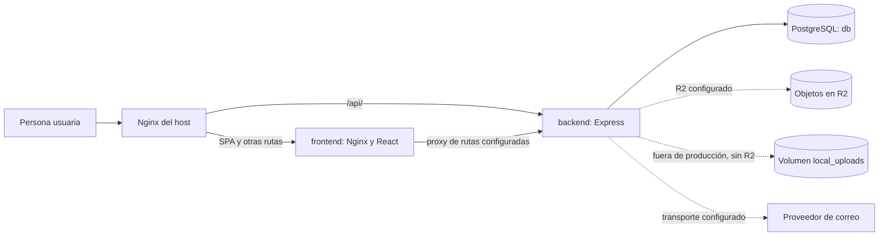

# Infraestructura y operación de VisaGuide (SCRUM-206)

## 1. Propósito y alcance

Esta guía describe la infraestructura **definida en el repositorio** para VisaGuide: construcción y ejecución con Docker Compose, rutas de red, configuración, monitoreo y recuperación de datos. Sirve como procedimiento para el operador de una instancia Ubuntu en AWS EC2 y como referencia para desarrollo local. Incluye una instantánea de la verificación de producción del 9 de octubre de 2026; su estado puede cambiar y debe volver a comprobarse antes de operar el servidor.

Las rutas indicadas son relativas a `visa-app/`, salvo donde se indica expresamente otra ubicación. La raíz del repositorio Git es el directorio padre de `visa-app/`. Los valores de producción deben permanecer fuera de Git. Los ejemplos con `<...>` son marcadores que se deben sustituir antes de ejecutar comandos; nunca son credenciales reales.

## 2. Arquitectura general

En producción, el Nginx del host recibe solicitudes y envía `/api/` al backend en el loopback del host; el resto llega al Nginx del contenedor frontend, que sirve la SPA. Este segundo Nginx también puede enviar `/api/`, `/documentos/` y `/local-files/` al servicio `backend` cuando se accede directamente al puerto 8080. Express consulta el servicio PostgreSQL `db`. Los archivos se envían a R2 cuando está configurado; el fallback en `local_uploads` solo se permite fuera de producción. El correo usa un transporte SMTP o Resend cuando está configurado.



### Flujo de una solicitud

1. El navegador solicita la SPA al Nginx del host; este la reenvía al servicio `frontend` publicado en loopback.
2. La SPA usa la base de API compilada en el build (`VITE_API_URL`). En el build de Compose, su valor predeterminado es `/api`.
3. Para `/api/`, el Nginx del host reenvía directamente al `backend`; el Nginx del frontend tiene su propio proxy `/api/` para accesos directos a `:8080`.
4. Express aplica CORS, procesa la ruta y consulta PostgreSQL. Si la operación requiere archivos o correo, usa las integraciones correspondientes.
5. Rutas como `/documentos/` pasan por el frontend cuando entran por la configuración del Nginx del host versionada; el Nginx del contenedor las reenvía al backend.

### Servicios y responsabilidades

| Servicio o componente | Responsabilidad | Fuente |
| --- | --- | --- |
| Nginx del host EC2 | Proxy público hacia backend y frontend; el archivo versionado solo configura HTTP | [`nginx/visa-app.duckdns.org.conf`](../nginx/visa-app.duckdns.org.conf) |
| `frontend` | Build React/Vite; Nginx sirve SPA y proxea rutas seleccionadas | [`frontend/Dockerfile`](../frontend/Dockerfile), [`frontend/nginx.conf`](../frontend/nginx.conf) |
| `backend` | API Node.js/Express, acceso a BD, archivos, correo y migraciones ligeras | [`backend/Dockerfile`](../backend/Dockerfile), [`backend/app.js`](../backend/app.js) |
| `db` | PostgreSQL 15 y datos relacionales | [`docker-compose.yml`](../docker-compose.yml), [`init.sql`](../init.sql) |
| R2 | Objetos de documentos, audios y comprobantes cuando está configurado | [`backend/storage.js`](../backend/storage.js), [`backend/r2.js`](../backend/r2.js) |
| Proveedor de correo | Envío condicional por SMTP o Resend | [`backend/config/email.js`](../backend/config/email.js) |

### Puertos

| Componente | Puerto interno | Publicación configurada | Alcance |
| --- | ---: | --- | --- |
| Nginx del host | 80 en el archivo versionado; 80 y 443 observados en EC2 | 80 y 443 | Público; la configuración TLS efectiva no está en este repositorio |
| `frontend` | 80 | `127.0.0.1:8080` | Solo loopback del host |
| `backend` | 3000 | `127.0.0.1:3000` | Solo loopback del host |
| `db` | 5432 | `5433:5432` | Docker publicó `0.0.0.0:5433` y `[::]:5433` en EC2 |
| Vite sin Docker | 5173 habitual | Servidor local de desarrollo | Fuera de Compose |

El puerto 5433 **no** está restringido a loopback por Compose. En la verificación del 9 de octubre, el Security Group no tenía una regla de entrada para 5433, aunque UFW estaba inactivo. Mantenga esa restricción y vuelva a comprobarla tras cualquier cambio de red; PostgreSQL no debe quedar accesible públicamente.

### Red, nombres y persistencia

Compose no declara redes propias: crea su red predeterminada y resuelve los nombres de servicio `backend`, `frontend` y `db` dentro de ella. El backend usa `db:5432` dentro de Compose; un proceso ejecutado en el host usa el puerto publicado 5433 y el host apropiado. El nombre real del contenedor puede variar: para comandos use el servicio `db`, nunca un nombre generado.

| Montaje | Tipo | Contenido y alcance |
| --- | --- | --- |
| `db_data:/var/lib/postgresql/data` | Volumen nombrado | Datos persistentes de PostgreSQL. No se elimina con un reinicio normal de contenedores. |
| `local_uploads:/app/local_uploads` | Volumen nombrado | Archivos del fallback local en desarrollo/test. Un dump SQL no lo incluye. |
| `./init.sql:/docker-entrypoint-initdb.d/init.sql` | Bind mount de archivo | Inicialización de una base nueva; no sustituye migraciones ni es un respaldo. |

`init.sql` crea el esquema inicial. `backend/app.js` y servicios con `ensureSchema()` añaden o ajustan tablas y columnas al iniciar. No se debe asumir que volver a montar `init.sql` migra una base ya existente. El seed de cuentas y trámites de prueba se ejecuta en `backend/app.js` cuando `NODE_ENV=development`.

## 3. Construcción y modalidades de ejecución

El Dockerfile del backend parte de Node 20, instala dependencias con `npm ci` y ejecuta `node index.js`; fija `NODE_ENV=production` en la imagen, pero Compose puede sobrescribirlo. El Dockerfile del frontend compila Vite con Node 20 Alpine y copia `dist` a una imagen Nginx 1.27 Alpine. `FRONTEND_API_URL`, `VITE_API_PORT` y `VITE_WHATSAPP_PHONE` se pasan como argumentos de build: sus valores quedan en el cliente compilado y **no deben contener secretos**.

| Modalidad | Comando desde `visa-app/` | Efecto relevante |
| --- | --- | --- |
| Desarrollo con Compose | `docker compose up --build` | Carga automáticamente `docker-compose.override.yml`, fuerza `NODE_ENV=development` y el secreto de sesión de desarrollo del override; puede crear datos de prueba. |
| Producción con Compose | `docker compose -f docker-compose.yml up -d --build` | Omite el override. Requiere configuración real de BD, un `SESSION_SECRET` único y R2 para operaciones de archivo. |
| Desarrollo sin Docker | `npm start` en `backend/` y `npm run dev` en `frontend/` | Requiere PostgreSQL accesible desde el host y variables locales apropiadas. |

El backend carga `backend/.env` mediante `dotenv` cuando se ejecuta localmente. Compose, en cambio, usa `.env` de `visa-app/` para interpolación y `env_file`. Ninguno de esos archivos con valores reales debe versionarse.

## 4. Variables de entorno

“Obligatoria” se refiere a la función indicada, no a que Compose valide su presencia. **Pública** significa que puede llegar al navegador; **configuración** describe parámetros operativos; **secreto** exige almacenamiento y acceso restringidos. Los archivos de ejemplo solo deben contener marcadores inequívocos.

### Base de datos

| Variable | Componente | Necesidad | Propósito | Clase |
| --- | --- | --- | --- | --- |
| `DB_HOST` | Backend; backup del host | Obligatoria | Host de PostgreSQL | Configuración |
| `DB_PORT` | Backend; backup del host | Obligatoria | Puerto de PostgreSQL | Configuración |
| `DB_USER` | Compose, backend y backup | Obligatoria | Usuario de BD | Configuración |
| `DB_PASSWORD` | Compose, backend y backup | Obligatoria | Autenticación de BD | Secreto |
| `DB_NAME` | Compose, backend y backup | Obligatoria | Base lógica | Configuración |
| `POSTGRES_USER` | Contenedor `db` | Derivada por Compose | Inicializar usuario desde `DB_USER` | Configuración |
| `POSTGRES_PASSWORD` | Contenedor `db` | Derivada por Compose | Inicializar contraseña desde `DB_PASSWORD` | Secreto |
| `POSTGRES_DB` | Contenedor `db` | Derivada por Compose | Inicializar base desde `DB_NAME` | Configuración |
| `PGPASSWORD` | `pg_dump` del host | Derivada por script | Autenticación temporal desde `DB_PASSWORD` | Secreto |

Compose deriva `POSTGRES_USER`, `POSTGRES_PASSWORD` y `POSTGRES_DB` de `DB_USER`, `DB_PASSWORD` y `DB_NAME` respectivamente. El script de backup deriva `PGPASSWORD` de `DB_PASSWORD` durante la ejecución; no ponga contraseñas en la línea de comandos. Los valores reales se obtienen de la configuración del entorno; no se presuponen a partir de `.env.example`.

### Backend y sesiones

| Variable | Componente | Necesidad | Propósito | Clase |
| --- | --- | --- | --- | --- |
| `NODE_ENV` | Backend; Compose | Obligatoria para distinguir producción | Controla seed y fallback local | Configuración |
| `SESSION_SECRET` | Backend | Obligatoria en producción | Firma de tokens de sesión | Secreto |
| `HOST` | Backend | Opcional | Dirección de escucha | Configuración |
| `PORT` | Backend | Opcional | Puerto de escucha | Configuración |
| `FRONTEND_URL` | Backend | Opcional; recomendable en producción | Base de enlaces de recuperación/verificación | Configuración |

En ausencia de `SESSION_SECRET`, el backend solo usa un valor de desarrollo fuera de producción; en producción no puede emitir sesiones. El override contiene un valor fijo para desarrollo que jamás debe aplicarse a EC2.

### Frontend y CORS

| Variable | Componente | Necesidad | Propósito | Clase |
| --- | --- | --- | --- | --- |
| `FRONTEND_API_URL` | Compose/build frontend | Opcional | Pasa la base de API a `VITE_API_URL` | Pública |
| `VITE_API_URL` | Frontend/build | Opcional | Base de solicitudes API | Pública |
| `VITE_API_PORT` | Frontend/build | Opcional | Puerto para API en desarrollo | Pública |
| `VITE_WHATSAPP_PHONE` | Frontend/build | Opcional | Contacto del asesor | Pública |
| `CORS_ALLOWED_ORIGINS` | Backend | Opcional | Lista de orígenes permitidos | Configuración |

El frontend lee `VITE_API_URL` y `VITE_API_PORT` en `frontend/src/config/api.js`, y `VITE_WHATSAPP_PHONE` en `frontend/src/utils/advisorContact.js`. El backend configura CORS en `backend/config/cors.js`; si la lista no se define, aplica sus orígenes predeterminados según `NODE_ENV`.

### R2 y almacenamiento

| Variable | Componente | Necesidad | Propósito | Clase |
| --- | --- | --- | --- | --- |
| `R2_ACCESS_KEY` | Backend | Obligatoria para uploads en producción | Identificador de acceso R2 | Secreto |
| `R2_SECRET_KEY` | Backend | Obligatoria para uploads en producción | Clave de acceso R2 | Secreto |
| `R2_BUCKET` | Backend | Obligatoria para uploads en producción | Bucket de objetos | Configuración |
| `R2_ENDPOINT` | Backend | Obligatoria para uploads en producción | Endpoint de R2 | Configuración |
| `LOCAL_UPLOAD_DIR` | Backend | Opcional | Directorio del fallback local | Configuración |

`backend/storage.js` usa R2 cuando la configuración es válida; solo fuera de producción permite guardar localmente. Compose monta `local_uploads` en el directorio del backend. Los uploads están limitados en `backend/upload.js` a 5 MB por archivo y 8 archivos; documentos admiten PDF/JPEG/PNG y audio de entrevista WebM según extensión y MIME. Nginx declara `client_max_body_size 25m` en ambas capas versionadas.

### Correo

| Variable | Componente | Necesidad | Propósito | Clase |
| --- | --- | --- | --- | --- |
| `EMAIL_PROVIDER` | Backend | Opcional | Elegir SMTP o Resend | Configuración |
| `SMTP_HOST` | Backend | Condicional para SMTP | Servidor SMTP | Configuración |
| `SMTP_PORT` | Backend | Opcional | Puerto SMTP | Configuración |
| `SMTP_SECURE` | Backend | Opcional | Selección de transporte seguro | Configuración |
| `SMTP_USER` | Backend | Condicional para SMTP | Usuario SMTP | Secreto |
| `SMTP_PASS` | Backend | Condicional para SMTP | Contraseña SMTP | Secreto |
| `SMTP_FROM` | Backend | Opcional | Remitente alternativo | Configuración |
| `EMAIL_FROM` | Backend | Opcional | Remitente preferido | Configuración |
| `RESEND_API_KEY` | Backend | Condicional para Resend | Acceso al proveedor | Secreto |
| `EMAIL_REMINDERS_MODE` | Backend | Opcional | `disabled` deshabilita recordatorios | Configuración |

Si falta el transporte, el código de recordatorios devuelve dry-run. **No** se debe suponer que `EMAIL_REMINDERS_MODE=dry_run` impida envíos cuando hay transporte configurado: `backend/services/emailReminderService.js` solo trata explícitamente `disabled` y, con transporte válido, intenta enviar. `backend/config/email.js` desactiva la verificación TLS del transporte Resend; es un riesgo pendiente, no una configuración recomendada.

### Pagos

| Variable | Componente | Necesidad | Propósito | Clase |
| --- | --- | --- | --- | --- |
| `PAYMENT_BANK_NAME` | Backend | Condicional para información bancaria completa | Banco | Configuración |
| `PAYMENT_ACCOUNT_NAME` | Backend | Condicional | Titular | Configuración |
| `PAYMENT_ACCOUNT_NUMBER` | Backend | Condicional | Número de cuenta | Configuración |
| `PAYMENT_ACCOUNT_TYPE` | Backend | Opcional | Tipo de cuenta | Configuración |
| `PAYMENT_BANK_INSTRUCTIONS` | Backend | Opcional | Instrucciones de pago | Configuración |

Estos datos de cuenta son configuración sensible: limite su acceso aunque no sean claves de autenticación.

### Backup y monitoreo del host

| Variable | Componente | Necesidad | Propósito | Clase |
| --- | --- | --- | --- | --- |
| `ENV_FILE` | Scripts de backup | Condicional para cron | Ruta del archivo externo con parámetros de BD | Configuración |
| `BACKUP_DIR` | Scripts de backup | Opcional | Directorio de dumps | Configuración |
| `BACKUP_PREFIX` | Scripts de backup | Opcional | Prefijo de archivos | Configuración |
| `RETENTION_DAYS` | Rotación/cron | Opcional | Antigüedad de dumps a conservar | Configuración |
| `BACKUP_LOG_FILE` | Instalador cron | Opcional | Ruta de log | Configuración |
| `BACKUP_CRON_SCHEDULE` | Instalador cron | Opcional | Horario | Configuración |
| `MONITOR_ENV_FILE` | Monitor/cron | Requiere archivo legible al ejecutar cron | Ruta de configuración externa | Configuración |
| `MONITOR_URL` | Monitor | Opcional | URL consultada | Configuración |
| `MONITOR_THRESHOLD` | Monitor | Opcional | Umbral porcentual | Configuración |
| `MONITOR_DISK_PATH` | Monitor | Opcional | Filesystem a medir | Configuración |
| `MONITOR_LOG_FILE` | Monitor | Opcional | Ruta de log | Configuración |
| `MONITOR_MAX_LOG_LINES` | Monitor | Opcional | Tamaño máximo del log en líneas | Configuración |
| `ALERT_EMAIL` | Monitor | Opcional | Destinatario de alertas | Configuración |
| `MONITOR_PROC_STAT_FILE` | Monitor | Opcional; solo pruebas | Fuente alternativa para medición simulada de CPU | Configuración |
| `DRY_RUN` | Instaladores cron | Opcional | Mostrar entrada propuesta sin instalar | Configuración |

La fuente de las variables de backup es `tools/backups/*.sh`; la de monitoreo es `tools/monitoring/*.sh`. `MONITOR_PROC_STAT_FILE` no es un ajuste normal de EC2. Proteja también el destinatario de alertas como dato personal.

## 5. Despliegue documentado para AWS EC2

El repositorio proporciona Compose y una configuración Nginx del host, **no** un instalador completo de EC2. El operador debe verificar que Ubuntu tenga Docker con Compose, Nginx, espacio para los volúmenes y reglas de red adecuadas. La ubicación de checkout usada abajo es un marcador: sustitúyala por la ruta real. Ejecute los comandos desde `visa-app/` en EC2:

```bash
cd '<RUTA_DEL_CHECKOUT>/visa-app'
docker compose -f docker-compose.yml config --quiet
docker compose -f docker-compose.yml up -d --build
docker compose -f docker-compose.yml ps
```

Antes de arrancar, cree y proteja `.env` fuera del control de versiones con los valores del entorno; compruebe `NODE_ENV=production`, `SESSION_SECRET`, `DB_*`, R2 y orígenes/URLs apropiados sin imprimir secretos en logs. Revise el firewall/security group para que 5433 no sea accesible públicamente. Instale la configuración de Nginx del host según el proceso operativo de la instancia y compruébela con `sudo nginx -t` antes de recargar el servicio. No use `docker compose up` sin `-f` en EC2: cargaría el override de desarrollo.

La configuración versionada del Nginx del host escucha en 80 y no contiene certificados ni un bloque 443. La verificación de EC2 del 9 de octubre sí comprobó la escucha en 443, una respuesta HTTP 200 mediante HTTPS y un certificado válido. Estos hechos corresponden al host observado, no al archivo Nginx de este repositorio; vuelva a comprobar la terminación TLS después de cambios en el servidor.

La raíz Git contiene [`.github/workflows/ci.yml`](../../.github/workflows/ci.yml): ejecuta pruebas de backend con PostgreSQL 15 y frontend con Node 22 en push/PR a `main`. **No contiene un job de despliegue automático**; construir y actualizar EC2 es una operación aparte.

### Estado verificado en EC2

La verificación de producción realizada el **9 de octubre de 2026** observó lo siguiente. Es una instantánea del servidor, no una garantía de estado futuro ni prueba de que el checkout local de esta guía estuviera desplegado:

- **Código y servicios:** el checkout de producción estaba en `main` y limpio. La versión desplegada observada era anterior a integraciones recientes; no se confirmó que SCRUM-203, SCRUM-204 o SCRUM-206 estuvieran desplegadas. Docker, Nginx y cron estaban activos. Frontend, backend y PostgreSQL estaban activos; PostgreSQL reportaba `healthy`.
- **Puertos y controles de red:** backend estaba publicado en `127.0.0.1:3000` y frontend en `127.0.0.1:8080`. Nginx escuchaba públicamente en 80 y 443. Docker publicaba PostgreSQL en `0.0.0.0:5433` y `[::]:5433`. UFW estaba inactivo. El Security Group tenía 80 y 443 abiertos públicamente para la web, pero ninguna regla de entrada para 5433; por tanto, AWS no permitía el acceso público a ese puerto en la verificación. También tenía reglas públicas para 3000 y 5173, aunque backend y frontend se observaron publicados solo en loopback; no se verificó un servicio en 5173. El puerto 22 estaba permitido desde cualquier IPv4. **Endurecimiento pendiente:** retirar las reglas públicas de 3000 y 5173 y restringir 22 a una fuente administrativa. Esta documentación no cambia AWS.
- **HTTPS:** el dominio productivo respondió HTTP 200 mediante HTTPS; Nginx validó correctamente su configuración y existía un certificado válido. El temporizador de Certbot estaba habilitado y activo. La expiración observada era el **23 de diciembre de 2026**: es un dato temporal y debe volver a verificarse.
- **Monitoreo:** existía un cron del usuario `ubuntu` cada cinco minutos que usaba `MONITOR_ENV_FILE` fuera del repositorio. Las muestras revisadas devolvieron HTTP 200; CPU, memoria y disco estaban por debajo del umbral configurado de 80 %, con estado final `OK`. Esto no verifica por sí solo la entrega de alertas por correo.
- **Backup de PostgreSQL:** no existían cron de backup, `/etc/visaguide/backup.env`, directorio esperado de dumps ni log esperado de backup. No se encontraron archivos `.dump` en `/var/backups`. Los scripts están disponibles en el repositorio, pero el backup automático de PostgreSQL **no estaba instalado en EC2**. No hay protección recuperable demostrada hasta ejecutar y validar un backup y una restauración de prueba.
- **R2:** las cuatro variables requeridas estaban presentes en `.env`; sus valores no se mostraron ni documentaron. Su presencia no demuestra acceso efectivo al bucket ni existencia de copias de seguridad de R2.

## 6. Salud y monitoreo

`db` tiene un health check basado en `pg_isready`; `backend` espera a que `db` esté saludable. No hay health checks declarados para `backend` ni `frontend`. `depends_on` del frontend solo ordena el inicio, no demuestra que la API esté lista.

Desde `visa-app/` en EC2, `docker compose -f docker-compose.yml ps` muestra el estado de los servicios. Una comprobación HTTP del frontend y de la API debe realizarse con la URL y puerto autorizados en el entorno, sin usar datos de usuario. El backend monta `/api-docs` y `/api-docs.json`; no hay una ruta de health dedicada de infraestructura.

[`tools/monitoring/`](../tools/monitoring/) contiene scripts para el **host Ubuntu**, no para los contenedores. Comprueban HTTP, CPU, memoria y disco. En EC2 se verificó el cron del usuario `ubuntu` cada cinco minutos y muestras con estado `OK`; las alertas por correo requieren `mail` y un MTA/relay operativo, cuya entrega no quedó comprobada. [`docs/server-monitoring.md`](server-monitoring.md) detalla instalación y validación. No se comprobó aquí el estado de un monitor externo.

## 7. Backup de PostgreSQL

**Estado en EC2 al 9 de octubre de 2026:** el backup automático no estaba instalado y no se encontraron dumps en la ubicación revisada. Los comandos siguientes describen cómo realizar y validar un respaldo; no son evidencia de que exista uno recuperable.

PostgreSQL guarda tablas de usuarios, trámites, DS-160, documentos y sus metadatos, entrevistas y referencias de audio, pagos, citas, notificaciones, chat, registros y otras tablas creadas por `init.sql` y las rutinas `ensureSchema()`. Los bytes de archivos quedan fuera de la BD. El servicio Compose es `db`; la base y el usuario reales vienen de `DB_NAME` y `DB_USER`, no se infieren del ejemplo.

### Opción A: script existente desde el host EC2

Prepare un archivo de configuración de backup legible solo por el usuario del job, fuera del repositorio, y una versión de `pg_dump` compatible con PostgreSQL 15. Consulte [`docs/backups-postgresql.md`](backups-postgresql.md) para cron y rotación. Desde la raíz `visa-app/` **en EC2**:

```bash
cd '<RUTA_DEL_CHECKOUT>/visa-app'
ENV_FILE=/etc/visaguide/backup.env \
BACKUP_DIR=/var/backups/visaguide/postgres \
tools/backups/backup_postgres.sh
```

El archivo externo debe definir `DB_HOST`, `DB_PORT`, `DB_USER`, `DB_PASSWORD` y `DB_NAME` con los valores reales del entorno; para el script que corre en el host, el puerto publicado es 5433. El script usa `pg_dump --format=custom`, escribe primero un `.incomplete`, exige que el resultado no esté vacío y después lo renombra. No cifra ni copia el dump fuera del host. La rotación puede borrar dumps antiguos: verifique recuperación y retención antes de automatizarla.

### Opción B: `pg_dump` mediante el servicio Compose

Esta alternativa usa las variables `POSTGRES_*` dentro del contenedor. Desde `visa-app/` **en EC2**, sustituya el marcador del archivo por una ruta absoluta protegida del host:

```bash
cd '<RUTA_DEL_CHECKOUT>/visa-app'
DUMP_FILE='<ARCHIVO.dump>'
docker compose -f docker-compose.yml exec -T db \
  sh -c 'pg_dump --username="$POSTGRES_USER" --dbname="$POSTGRES_DB" --format=custom' \
  > "$DUMP_FILE"
```

La redirección escribe en el host. Compruebe el código de salida y el archivo antes de considerarlo un backup. No use el nombre generado del contenedor.

### Verificación del dump

Desde `visa-app/` **en el host**, con `pg_restore` instalado y el archivo accesible:

```bash
DUMP_FILE='<ARCHIVO.dump>'
test -s "$DUMP_FILE"
pg_restore --list "$DUMP_FILE" > /dev/null
```

Si `pg_restore` no está instalado en el host, se puede listar mediante Compose, desde `visa-app/`:

```bash
DUMP_FILE='<ARCHIVO.dump>'
docker compose -f docker-compose.yml exec -T db pg_restore --list < "$DUMP_FILE" > /dev/null
```

La lista legible y un archivo no vacío verifican el formato, **no** una recuperación completa. Registre fecha, tamaño, ubicación, resultado de los comandos y comprobación de una restauración temporal.

## 8. Restauración segura en una base temporal

La validación ordinaria crea una base nueva claramente distinta de la principal. Ejecute lo siguiente desde `visa-app/` **en EC2**, después de sustituir los marcadores. `DB_USER` debe ser el usuario configurado para PostgreSQL; `TEMP_DB` debe ser un nombre nuevo que no exista:

```bash
cd '<RUTA_DEL_CHECKOUT>/visa-app'
DB_USER='<DB_USER>'
DB_NAME='<DB_NAME>'
TEMP_DB='visaguide_restore_YYYYMMDD'
DUMP_FILE='<ARCHIVO.dump>'
if [ "$TEMP_DB" = "$DB_NAME" ]; then
  echo 'La base temporal debe ser distinta de la principal.' >&2
else
  if docker compose -f docker-compose.yml exec -T db \
    createdb --username="$DB_USER" "$TEMP_DB"; then
    docker compose -f docker-compose.yml exec -T db \
      pg_restore --username="$DB_USER" --dbname="$TEMP_DB" \
      --exit-on-error --no-owner --no-privileges < "$DUMP_FILE"
  fi
fi
```

Si la base temporal ya existe, **deténgase** y elija otro nombre; no sustituya una base existente durante la validación. Cuando corresponda autenticación adicional, configure el acceso de PostgreSQL mediante un mecanismo seguro del entorno, sin exponer una contraseña en argumentos o historial del shell.

### Comprobaciones después de restaurar

Desde el mismo directorio y con las variables anteriores:

```bash
docker compose -f docker-compose.yml exec -T db \
  psql --username="$DB_USER" --dbname="$TEMP_DB" -v ON_ERROR_STOP=1 -c '\dt'
docker compose -f docker-compose.yml exec -T db \
  psql --username="$DB_USER" --dbname="$TEMP_DB" -v ON_ERROR_STOP=1 \
  -c 'SELECT COUNT(*) FROM usuario;'
docker compose -f docker-compose.yml exec -T db \
  psql --username="$DB_USER" --dbname="$TEMP_DB" -v ON_ERROR_STOP=1 \
  -c 'SELECT COUNT(*) FROM documentos;'
```

Compare el esquema, los conteos y una muestra representativa con el alcance esperado del dump. Verifique separadamente que los objetos referenciados por documentos, audios y comprobantes existen en R2 o `local_uploads`, según el caso. La restauración solo se considera probada cuando `pg_restore` termina sin error, las consultas funcionan y los archivos asociados son recuperables. Conserve la evidencia y el nombre exacto del dump.

## 9. Restauración de emergencia — operación destructiva

**ADVERTENCIA: sustituir la base principal, usar `pg_restore --clean`, ejecutar `dropdb` o eliminar volúmenes puede destruir datos. No ejecute estas acciones como primera prueba.**

1. Declare una ventana de mantenimiento; detenga las escrituras de la aplicación y determine el alcance del incidente.
2. Cree un **backup previo** de la base afectada y resguarde también los archivos pertinentes. Conserve una copia fuera de la instancia cuando la política operativa lo permita.
3. Restaure el dump elegido en una base temporal distinta, complete las comprobaciones de la sección anterior y confirme el punto temporal de recuperación.
4. Solo después, un operador autorizado puede planificar la sustitución de la base principal. Si usa `pg_restore --clean --if-exists`, marque el comando y el objetivo exacto como **destructivos** y compruebe dos veces `DB_NAME`; no lo use contra la base de producción por conveniencia ni desde un script de validación.
5. Reanude la aplicación, compruebe login, dashboard, documentos y flujos críticos, y documente el dump, la intervención y la pérdida de datos entre backup e incidente.

No hay en este repositorio una restauración automática de emergencia ni un mecanismo que coordine transaccionalmente el dump SQL con R2. Una recuperación real debe seguir el procedimiento y permisos del entorno EC2.

## 10. Archivos persistentes fuera de PostgreSQL

Un dump SQL contiene referencias y metadatos, **no** los bytes de documentos, audios de entrevistas ni comprobantes de pago. Fuera de producción, respalde por separado el volumen nombrado `local_uploads`; no suponga que sus archivos estén directamente en el árbol del repositorio. En producción, verifique una política independiente de copia, retención y prueba de lectura de los objetos R2. El repositorio no demuestra un backup automatizado de R2. Coordine el momento del respaldo de archivos con el dump para evitar referencias huérfanas o archivos sin registro.

Para obtener un archivo del volumen local, desde `visa-app/` **en EC2 o en el host de desarrollo**, con el servicio `backend` activo y `tar` disponible dentro de su imagen, sustituya el marcador por una ruta protegida del host:

```bash
cd '<RUTA_DEL_CHECKOUT>/visa-app'
docker compose -f docker-compose.yml exec -T backend \
  tar -C /app/local_uploads -cf - . > '<ARCHIVO_LOCAL_UPLOADS.tar>'
tar -tf '<ARCHIVO_LOCAL_UPLOADS.tar>' > /dev/null
```

La lectura del índice verifica el formato del archivo, no todos sus contenidos. Para R2, un procedimiento externo debe enumerar y copiar los objetos del bucket configurado a un destino independiente, conservar un manifiesto de claves y tamaños y probar la descarga de una muestra junto con las referencias SQL. Este repositorio no contiene un script para esa operación; no afirme que los objetos están respaldados sin evidencia de la copia y una prueba de recuperación.

Un dump SQL tampoco incluye `.env` o configuración externa, certificados, reglas del host, entradas de cron, logs, configuración efectiva de Nginx ni datos de otros servicios. Proteja sus copias con permisos restrictivos y manténgalas fuera de Git.

## 11. Seguridad y manejo de secretos

- Mantenga `.env`, `backend/.env`, `/etc/visaguide/backup.env` y configuración del monitor fuera del repositorio, con acceso solo para el usuario o servicio correspondiente. No imprima sus contenidos al validar Compose: use `docker compose ... config --quiet`.
- Use un `SESSION_SECRET` único en producción. El valor fijo del override es solo para desarrollo; cargar el override en EC2 activaría además el seed de prueba.
- Mantenga 5433 cerrado a entradas públicas en el Security Group y vuelva a comprobarlo tras cambios; `5433:5432` no crea esa restricción por sí mismo.
- No coloque secretos en `VITE_*` ni en argumentos de build: se distribuyen al navegador. Trate datos bancarios y destinatarios de alertas como información sensible.
- HTTPS y el certificado se verificaron en EC2 el 9 de octubre de 2026, pero la configuración TLS efectiva no está versionada aquí. Compruebe periódicamente su vigencia y la terminación real en el host.
- `backend/config/email.js` configura Resend con verificación TLS deshabilitada. Es un riesgo pendiente del código, fuera del alcance de esta tarea documental.

## 12. Solución de problemas

| Síntoma | Comprobación segura | Referencia |
| --- | --- | --- |
| Backend no inicia o no conecta a BD | `docker compose -f docker-compose.yml ps`; comprobar estado saludable de `db` y nombres `DB_*` sin imprimir valores | `docker-compose.yml`, `backend/app.js` |
| Frontend carga pero API falla | Verificar build de `VITE_API_URL`, ambos Nginx y ruta `/api/`; comprobar si se usó el override | `frontend/nginx.conf`, `nginx/visa-app.duckdns.org.conf` |
| Error al subir o leer archivos | Verificar configuración R2 en producción; fuera de producción, volumen `local_uploads`, límite de 5 MB y tipo admitido | `backend/storage.js`, `backend/upload.js` |
| Backup ausente o vacío | Comprobar cron real, permisos del archivo externo, `pg_dump`, disco, log y `pg_restore --list` | `tools/backups/`, `docs/backups-postgresql.md` |
| Monitor no alerta | Verificar crontab real, `MONITOR_ENV_FILE`, log y MTA/relay de correo; el script solo no garantiza entrega | `docs/server-monitoring.md` |
| HTTPS no responde | Revisar configuración/certificados efectivos de EC2; el Nginx versionado solo declara HTTP | `nginx/visa-app.duckdns.org.conf` |

## 13. Limitaciones y riesgos pendientes

- PostgreSQL 5433 está publicado en todas las interfaces por Compose y Docker; el Security Group no permitía entrada por ese puerto el 9 de octubre de 2026. UFW estaba inactivo. Mantenga y vuelva a verificar el control de acceso.
- Backend y frontend carecen de health checks en Compose; solo `db` tiene uno.
- El override de desarrollo contiene un secreto de sesión fijo y fuerza `NODE_ENV=development`.
- HTTPS, certificado, Nginx, servicios y cron de monitoreo se comprobaron en EC2 el 9 de octubre de 2026; su estado actual y la entrega de alertas por correo requieren nuevas verificaciones. La configuración TLS efectiva no está versionada.
- El checkout observado en producción era anterior a integraciones recientes; no se confirmó el despliegue de SCRUM-203, SCRUM-204 o SCRUM-206.
- El Security Group aún tenía reglas públicas para 3000 y 5173 y permitía 22 desde cualquier IPv4. Queda pendiente retirar las primeras y restringir SSH a una fuente administrativa.
- El esquema se distribuye entre `init.sql`, `backend/app.js` y servicios con `ensureSchema()`; no hay una única secuencia de migraciones versionadas.
- El backup automático de PostgreSQL no estaba instalado en EC2; falta crear y validar un dump y probar una restauración. No se demuestra acceso efectivo ni backup de R2, ni restauración coordinada de R2 o del volumen `local_uploads`.
- GitHub Actions valida cambios en `main`, pero no despliega a EC2.
- Los scripts de validación de backup usan un `pg_dump` simulado; una restauración temporal real sigue siendo necesaria para comprobar recuperabilidad de datos.
